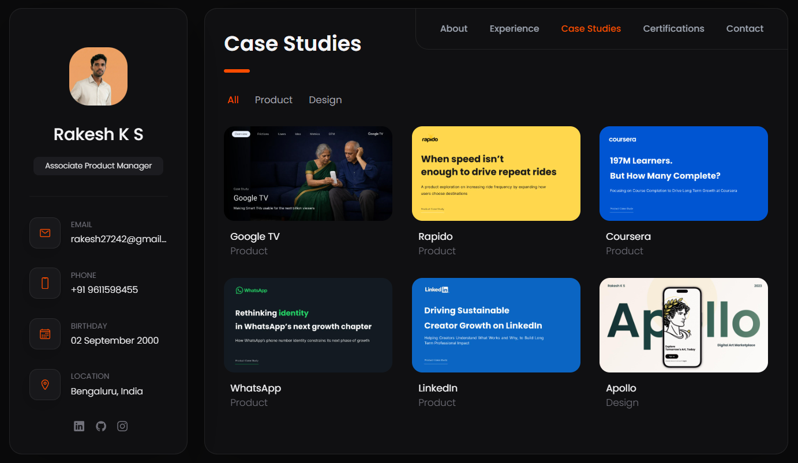

# Rakesh K S – Portfolio

---

## Portfolio Preview

---

## About Me

I’m **Rakesh K S**, an **Associate Product Manager based in Bengaluru, India**.

I currently work on a **B2B digital signature platform**, focused on simplifying document workflows and building reliable tools that help businesses operate more efficiently.

My work involves **product discovery, defining product strategy, prioritizing roadmaps, and collaborating closely with engineering, design, and business teams** to deliver impactful products.

---

## Work Experience and Education

My portfolio highlights my professional journey including:

- Experience working as an **Associate Product Manager at Melento**
- Building and improving **B2B SaaS products**
- Academic background in **Electronics & Communication Engineering**
- Strong foundation in **technology-driven problem solving**

---

## Product and Design Case Studies

The portfolio features product thinking and product design work including:

- **Simple TV**
- **Rapido**
- **Coursera**
- **WhatsApp**
- **LinkedIn**
- **Apollo Design Case Study**

---

## Professional Certifications

Certifications included in the portfolio:

- **HelloPM – Product Management Certification**
- **Google UX Design Certificate**

---

## Tech Stack

The website is built using:

- HTML  
- CSS  
- JavaScript  

and is designed to be **fully responsive across devices**.

---

## Connect With Me

**Email**  
rakesh27242@gmail.com

**Location**  
Bengaluru, Karnataka, India